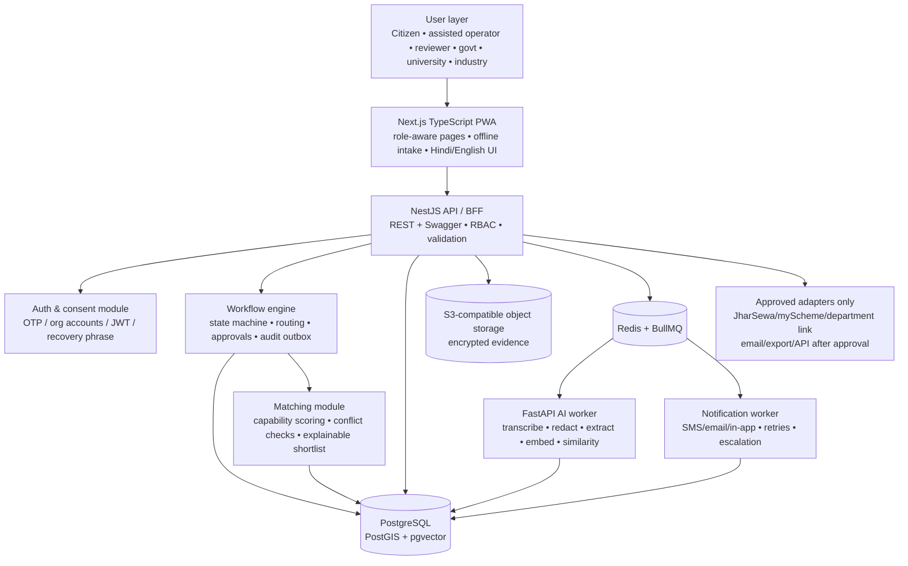
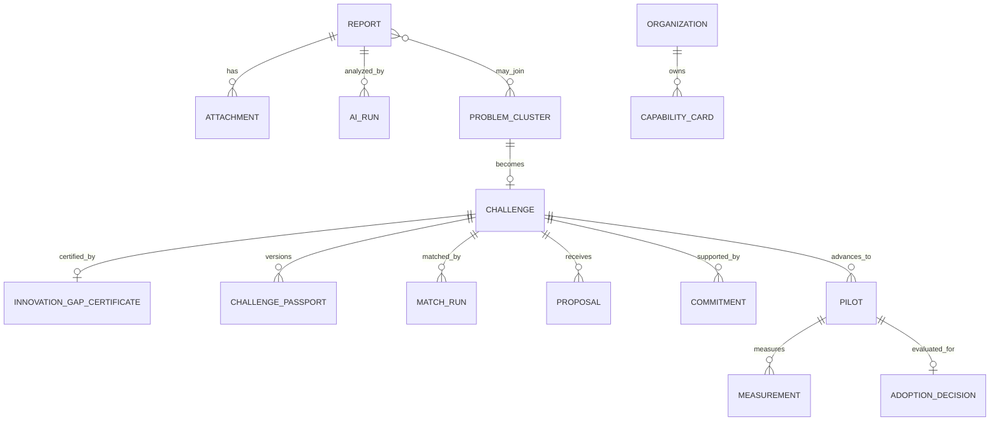

# JharSetu — Final System Workflow and Build Blueprint

**Version:** SIH selection-round / six-developer implementation blueprint  
**Product name:** JharSetu — Innovation Gap Exchange for Jharkhand  
**Build principle:** AI prepares evidence; accountable humans make routing, certification, funding, pilot, and adoption decisions.

---

## 0. The one product we are building

JharSetu is a **governed problem-to-adoption platform**. A citizen, community worker, or assisted operator records a local problem in a low-literacy-friendly way. The platform converts it into a structured, privacy-protected evidence record. A reviewer decides whether it is:

1. a known government service or scheme need (**Path A**),
2. an operational grievance that the responsible authority should resolve (**Path B**), or
3. a recurring, verified gap that merits a university–industry–government innovation pilot (**Path C**).

Path C is the differentiation. It does not stop at “submit an idea” or “match a college.” It produces a decision trail:

`verified evidence → Innovation Gap Certificate → Challenge Passport → capability-based university shortlist → recorded industry commitment → government validation → Pilot Readiness Contract → field pilot → adoption dossier`.

### What JharSetu is not

- It is **not** a replacement for JharSewa, myScheme, CPGRAMS, a department grievance system, or procurement software.
- It does **not** claim an existing government API or a real partnership. An external hand-off remains an approved-link, export, email, or API adapter until an authority formally approves an integration.
- It is **not** a public complaint wall. Raw reports, identities, phone numbers, media, and precise locations are never automatically public.
- It is **not** an autonomous AI government. AI cannot issue a certificate, assign official responsibility, select a pilot, or approve adoption.

### One architecture decision

Build a **modular monolith**, not a microservice fleet:

- One **Next.js PWA** for every role, with role-specific routes and navigation.
- One **NestJS API** containing well-separated modules and a workflow/state-machine service.
- One **FastAPI AI worker** for asynchronous, reviewable analysis.
- One **PostgreSQL database** with PostGIS and pgvector.
- Redis/BullMQ for jobs and notifications; S3-compatible object storage for encrypted evidence.

This is deployable and understandable by six students. The module boundaries make later extraction possible only when usage proves it necessary.

---

## 1. Roles, authority, and core state machine

### Roles

| Role | Account type | Can do | Cannot do |
|---|---|---|---|
| Citizen | OTP account or anonymous case | submit, track, add evidence, consent | see others’ reports, certify a gap |
| Assisted operator | verified CSC/field/college operator | submit on someone’s behalf with consent | replace the reporter’s consent |
| Reviewer | verified program reviewer | inspect redacted evidence, route, merge, request clarification | approve government pilot/adoption |
| Department officer | government organization member | accept Path B referral, update action, validate fit | see hidden identity unless explicitly authorized |
| Government decision maker | authorized nodal/department authority | validate Path C, approve pilot readiness/adoption | alter original evidence without audit |
| University lead | verified institution member | maintain capability card, express interest, submit solution | self-certify selection |
| Industry/CSR lead | verified organization member | record a specific non-binding/approved commitment, submit support evidence | select university or approve government action |
| Administrator | platform operations | configure taxonomies, jurisdictions, organizations, permissions | make a decision under another role without an auditable role switch |

### States

There are two linked objects: an individual **Report** and a shared **Problem Cluster**. Never lose an individual report just because it is merged into a cluster.

```text
Report:
DRAFT → SUBMITTED → PROCESSING → UNDER_REVIEW
  ├─ NEEDS_INFORMATION → UNDER_REVIEW
  ├─ REJECTED
  ├─ MERGED_TO_CLUSTER
  ├─ PATH_A_REFERRED
  ├─ PATH_B_ASSIGNED → ACTION_IN_PROGRESS → RESOLVED / CLOSED_UNRESOLVED
  └─ PATH_C_CANDIDATE → LINKED_TO_CHALLENGE

Challenge / Path C:
CANDIDATE → EVIDENCE_VERIFIED → IGC_ISSUED → PASSPORT_PUBLISHED
→ MATCHING_OPEN → UNIVERSITY_SHORTLISTED → TEAM_SELECTED
→ COMMITMENTS_PENDING → PROPOSAL_SUBMITTED → GOVERNMENT_REVIEW
→ REVISION_REQUESTED / PILOT_READY → PILOT_ACTIVE → PILOT_EVALUATION
→ ADOPTION_APPROVED / ITERATE / STOPPED → SCALED
```

Every transition is executed by `POST /transitions`, checked against a role-and-state policy, written in the same transaction as an `audit_events` row, and emitted through an outbox event. The UI never changes status directly in the browser.

---

## 2. Final architecture



| Component | What it does | Why it exists |
|---|---|---|
| Next.js PWA | single responsive application, installable Android experience, route guards, forms, dashboard | one codebase instead of separate citizen and officer apps |
| NestJS | REST API, modules, RBAC, state transition guards, Swagger contract | keeps business rules off the frontend |
| Workflow engine | validates permitted transition, creates tasks/deadlines, writes audit/outbox | makes “what happens next?” deterministic |
| FastAPI worker | runs queued AI analysis and returns structured outputs with model/version/confidence | AI is isolated, asynchronous, and replaceable |
| PostgreSQL | transactional source of truth | reports, roles, decisions, tasks, certificates |
| PostGIS | geographic boundaries and proximity search | village/district routing and spatial clustering |
| pgvector | vector embeddings beside transactional data | duplicate candidate retrieval without another platform |
| Redis/BullMQ | analysis, notification, virus scan, retry jobs | no slow AI request blocks citizen submission |
| Object storage | original media and attachments, private signed access | database remains compact; evidence is controlled |
| Adapters | approved official routes only | no invented integrations or unauthorized data sharing |

---

## 3. Exact master workflow: citizen presses Submit to government adoption

`Problem` below means the individual report until it is clustered. IDs are generated server-side: `RPT-…`, `CL-…`, `CH-…`, `IGC-…`, `CP-…`.

| # / trigger | Actor, screen, and button | API / backend action | Database + AI | Validation / notification / next state / audit |
|---|---|---|---|---|
| 1. Start | Citizen, **Submit a problem** → `Start report` | `POST /reports/drafts` | creates `reports` row, state `DRAFT` | mode selected before content; audit `REPORT_DRAFT_CREATED` |
| 2. Identity choice | Citizen selects **Anonymous**, **Confidential/identified**, or **Assisted submission** | `PATCH /reports/:id/privacy` | privacy mode, consent version, reporter PII stored separately if supplied | anonymous receives recovery phrase only; audit consent |
| 3. Describe | Citizen enters voice/text, category hint, location, impact, evidence; presses **Continue** | media pre-signed upload; `PATCH /reports/:id` | encrypted media object; report fields | required: description/voice, location granularity, consent; client warns no emergency response |
| 4. Submit | Citizen presses **Submit problem** | `POST /reports/:id/submit` | transaction locks report, state `SUBMITTED`; outbox `PROBLEM_SUBMITTED`; queue `analyze-report` | return tracking ID; in-app/SMS only if contact exists; audit includes field hash, not raw text |
| 5. Analysis begins | System worker | internal job `analyze-report` | virus scan; speech-to-text; translation; PII redaction; structured extraction; embedding | state `PROCESSING`; all outputs become versioned `ai_runs`, never overwrite original |
| 6. Duplicate candidates | System | internal vector + PostGIS query | candidate reports/clusters and feature scores | candidates are suggestions, not a merge; outbox `AI_ANALYSIS_READY` |
| 7. Review queue | Reviewer opens **Review queue**, clicks a case | `GET /review/tasks?state=ready`; `GET /reports/:id/review` | returns redacted narrative, AI card, candidate clusters, jurisdiction recommendation | state `UNDER_REVIEW`; reviewer identity must have territory/category scope; audit `REVIEW_OPENED` |
| 8. Evidence decision | Reviewer chooses **Request information**, **Link to cluster**, **Route A**, **Route B**, **Propose Path C**, or **Reject** | `POST /reports/:id/decision` with reason code/comment | creates `review_decisions`; may create/refine cluster and route task | server checks mandatory rationale and evidence conditions; notification to citizen; immutable audit |
| 9A. Known service | Reviewer selects Path A | creates `official_hand_offs`; `POST /adapters/:adapter/prepare` only if approved | mapped service/scheme URL, prefilled non-sensitive summary only with consent | state `PATH_A_REFERRED`; citizen sees official link/reference, not a fake “resolved” claim |
| 9B. Operational issue | Reviewer selects Path B and authority | creates `authority_cases`, SLA task | authority mapping version and redacted evidence pack | state `PATH_B_ASSIGNED`; officer gets `PATH_B_ASSIGNED`; audit records mapping basis |
| 9C. Innovation gap | Reviewer selects **Propose Path C** | `POST /clusters/:id/path-c-candidate` | candidate cluster links reports, evidence count, affected area, unmet-need statement | state `CANDIDATE`; requires independent corroboration or field verification; reviewer cannot issue certificate alone if policy requires second reviewer |
| 10. Certificate | Lead reviewer + second reviewer/authorized approver | `POST /challenges/:id/issue-certificate` | creates immutable `innovation_gap_certificates` PDF/JSON snapshot | state `IGC_ISSUED`; serial number, signers, evidence snapshot hash, expiration; audit each signature |
| 11. Passport | Reviewer edits structured challenge, presses **Publish Passport** | `POST /challenges/:id/publish` | challenge passport, public-safe geo resolution, metric/constraint records | PII/redaction/publication checklist must pass; state `PASSPORT_PUBLISHED`; notify eligible organizations |
| 12. Match | System produces shortlist; reviewer approves opening | `POST /challenges/:id/match/run` then `POST /challenges/:id/open-matching` | capability scores, exclusions, scoring explanation snapshot | models never select winner; state `MATCHING_OPEN`; universities get invitation |
| 13. University proposal | University lead clicks **Express interest** then **Submit concept** | `POST /challenge-interests`, `POST /proposals` | proposal, team, capability claims, lab/field proof references | verified institution membership; state remains matching/proposal; reviewer gets notification |
| 14. Commitment | Industry/CSR lead clicks **Record commitment** | `POST /commitments` | amount/in-kind/mentor/access, conditions, approver, status | label is `PENDING` until organization approver confirms; no logo = no commitment; audit |
| 15. Government validation | Government decision maker opens **Government review** and chooses **Request revision**, **Approve pilot readiness**, or **Stop** | `POST /government-decisions` / transition | validation checklist, site, department owner, budget/funding status, risk controls | no approval without owner, pilot metrics, community consent plan, date window; state `PILOT_READY` or `REVISION_REQUESTED` |
| 16. Pilot contract | Government, university, industry acknowledge responsibilities | `POST /pilots/:id/acknowledgements` | pilot readiness contract, milestones, RACI, measurement baseline | all required acknowledgements change to `PILOT_ACTIVE`; notify all actors; audit |
| 17. Field pilot | Field lead posts milestones/evidence | `POST /pilots/:id/updates`; `POST /measurements` | measurements, evidence, issues, cost and outcome data | only permitted role can add; late SLA triggers escalation |
| 18. Evaluation | Government reviewer clicks **Evaluate pilot** | `POST /pilots/:id/evaluation` | compares baseline, targets, result, safety/feasibility | state `PILOT_EVALUATION`; decision task created |
| 19. Adoption | Authorized government approver presses **Approve adoption**, **Iterate**, or **Stop** | `POST /adoption-decisions` | adoption decision + exportable dossier | legal/procurement note must be recorded; state `ADOPTION_APPROVED`, `ITERATE`, or `STOPPED`; no automatic procurement |
| 20. Scale / close | Nodal officer | `POST /adoptions/:id/scale-update` | rollout scope/status and public-safe outcome | public dashboard gets aggregate only; full timeline permanently auditable |

### Workflow invariants

- A report can be *linked* to a cluster but is never deleted.
- Any human decision must carry `reason_code`, short rationale, actor, time, policy version, and previous/new state.
- Every automatic task has a human review state. Low-confidence AI goes to `NEEDS_HUMAN_REVIEW`, never to an authority automatically.
- Private identity and original media are not copied into a passport, matching card, or public dashboard.

---

## 4. Citizen and assisted journey: exact pages, fields, buttons

### Public navigation

`Home | Report a problem | Track report | Open challenges | How it works | Language | Sign in`

### 4.1 Home (`/`)

Hero: **“Tell us a local problem. We will show its accountable next step.”**

Buttons:

- `Report a problem` → `/report/new`
- `Track my report` → `/track`
- `View verified challenges` → `/challenges`
- `Use assisted submission` → `/assisted/find` (shows information, not an invented live CSC directory)
- language switch `हिंदी / English`; future Jharkhand language packs only after tested support

Show only aggregates: verified challenges, departments engaged, pilots—not unverified counts or named partners without consent.

### 4.2 Start mode (`/report/new`)

Cards:

| Card | Text | Data behavior |
|---|---|---|
| **Anonymous** | “No phone or name. Save the recovery phrase.” | no account; receive `case_id` + one-time recovery phrase; no proactive notifications |
| **Confidential / identified** | “Share contact privately so we can ask follow-up questions.” | OTP phone or email; PII encrypted and hidden from public / most reviewers |
| **Assisted submission** | “A verified operator helps you submit.” | operator must identify self; reporter selects anonymous or confidential and gives explicit consent |

Buttons: `Continue anonymously`, `Continue with contact`, `I am assisting someone`, `Back`.

Required consent checkbox: “I understand this is not emergency response and I should contact local emergency services for immediate danger.” A separate checkbox authorizes contact; it is never pre-ticked.

### 4.3 Report wizard (`/report/new/:draftId`)

**Step 1 — Tell us what happened**

- large `Hold to record` voice button, `Stop`, `Play`, `Delete recording`
- text area “Explain in your own words”
- category chips: Water, Road/public works, Agriculture, Health, Education, Livelihood, Environment, Other; choose `Not sure` safely
- impact chips: `one person`, `many households`, `village`, `multiple villages`; `urgent safety concern` (does not promise emergency dispatch)
- `Save and continue`

**Step 2 — Where and when?**

- select District → Block → Panchayat/Village where reference data exists
- map pin `Use current location`, `Drop pin`, `Use village only`
- date/frequency: `Today`, `Since last week`, `Recurring`, `Other`
- location precision disclosure: “Exact pin is visible only to authorized reviewers; public views use a coarser area.”

**Step 3 — Evidence (optional unless a policy requires it)**

- `Add photo`, `Add video`, `Add document`, `Skip for now`
- capture caption; upload status; media consent tick box
- warning: “Do not upload someone’s identity document, bank details, or images of people without permission.”

**Step 4 — Review and submit**

- shows user’s original narrative plus machine transcript labelled **“Draft transcription—please correct if needed”**
- field list and privacy mode; `Edit` per section
- buttons `Save draft`, `Submit problem`, `Cancel draft`

**After submit (`/report/received/:caseId`)**

- success state: case ID, status **Received—analysis and human review pending**, expected communication disclaimer
- anonymous: show recovery phrase once and force `I saved it`; `Download case receipt` contains ID only
- confidential: `Go to my reports`
- **not** shown: public map, other complainants, authority contact, AI “verdict”.

### 4.4 Track report (`/track`)

Input either `case ID + recovery phrase` (anonymous) or sign in (confidential). Show a plain-language timeline:

`Received → being prepared for review → under human review → [referred / joined to a verified issue / needs more information / closed]`.

Actions: `Add information`, `Withdraw contact consent` (does not erase required audit record), `Report a privacy concern`. Anonymous users may add a contact later, never retrospectively reveal prior data publicly.

### 4.5 Citizen dashboard (`/citizen`)

Cards: **My reports**, **Needs my information**, **Updates**, **Privacy controls**. Report detail contains status, redacted decision rationale, official hand-off link/reference if any, and `Add information`. It never reveals internal reviewer notes, other reporters, scoring, or personal details of officers.

### 4.6 Assisted operator flow

Operator signs in and clicks `New assisted report`. Before content, screen shows:

- reporter’s chosen mode; `Anonymous` remains anonymous even from later public/organization views;
- language used; a read-back toggle; `I read this summary back to the reporter` attestation;
- consent capture: signature/photo only if policy permits; otherwise operator attestation with time and location;
- buttons `Save with reporter`, `Submit with reporter`, `Cancel`.

The record stores `submitted_by_user_id`, `reporter_mode`, `assistance_consent_at`, and does **not** treat operator contact as reporter contact.

---

## 5. Intake contract, privacy separation, and `POST /reports`

### Report creation request

`POST /v1/reports`

```json
{
  "privacyMode": "ANONYMOUS | CONFIDENTIAL | ASSISTED",
  "language": "hi",
  "description": "optional typed statement",
  "categoryHint": "WATER",
  "impactScope": "VILLAGE",
  "occurredAt": "2026-09-10",
  "location": {
    "districtCode": "...",
    "blockCode": "...",
    "villageCode": "...",
    "latitude": 23.7,
    "longitude": 85.3,
    "precisionConsent": "EXACT_REVIEWERS_ONLY"
  },
  "attachments": [{"uploadId": "upl_...", "caption": "..."}],
  "consents": {"termsVersion": "2026-09-01", "contactAllowed": false}
}
```

The API rejects unknown fields, no raw PII in the general report body, oversized media, unsupported content types, missing consent, invalid location hierarchy, and attempts to submit another role’s identity.

### PII design

| Store | Contains | Access |
|---|---|---|
| `reports` | redacted narrative, category, status, coarse location, timestamps | normal workflow roles by scope |
| `reporter_profiles` | name, phone/email, preferred contact, encrypted | only privacy-contact permission; not joined by default |
| `report_contacts` | encrypted callback channel and consent | notification service and narrow follow-up workflow |
| object storage original | original audio/photo/video/document | signed URL after role + case authorization |
| `public_challenges` view | deidentified aggregate problem statement only | public |

Use envelope encryption through the cloud KMS/secret manager in production. In the MVP, use an application encryption key injected through a secret manager; never commit it. Every PII reveal is a `PII_ACCESSED` audit event with reason.

### Anonymous identity model

An anonymous reporter receives a random case ID plus a recovery phrase generated server-side. Only a slow hash of the phrase is stored. The phrase is shown once; it cannot be recovered by the platform. Anonymous means no routine notifications and no identity recovery. It does **not** mean immunity from lawful process, nor a guarantee that uploaded media has no identifying information—hence the pre-upload warning and redaction review.

---

## 6. AI pipeline: exact, bounded, and reviewable

### Recommended MVP model set

These are the build baseline, not claims that they are already government-approved. Pin exact model revisions and test on consented Hindi/Jharkhand-context samples before a production launch.

| Task | Component | Input → output | Human control |
|---|---|---|---|
| Speech-to-text | `faster-whisper` running `large-v3-turbo` | audio → transcript with segments/confidence | citizen can correct; low confidence marked |
| Language identification | `fastText lid.176` + script checks | text/audio transcript → language confidence | route to manual transcription if unclear |
| Translation | approved BHASHINI connector when available; otherwise self-hosted `IndicTrans2` | Hindi/local-language text → reviewer working translation | original text always retained; translation is not evidence replacement |
| PII detection | Microsoft Presidio + regexes for phone, Aadhaar-like, bank, address; reviewer mask tool | text/media OCR → redaction candidates | reviewer confirms before external/public release |
| Extraction/classification | `Qwen2.5-7B-Instruct` with strict JSON schema, temperature 0; deterministic taxonomy rules as guardrails | redacted text → category, entities, impact, frequency, route hints | no direct route; reviewer sees confidence and evidence spans |
| Embedding / retrieval | `BAAI/bge-m3` | redacted normalized summary → vector | only retrieves candidates |
| OCR | Tesseract for MVP where permitted | image/document → text for the same redaction/extraction path | preview and manual verification required |

No model decides Path A/B/C, government responsibility, a certificate, selection, funding, safety, or adoption. No facial recognition, emotion inference, social scoring, predictive policing, or training on user reports is in scope.

### Worker sequence

1. `analyze-report` job locks report version and logs `AI_RUN_STARTED`.
2. Malware scan attachment; quarantine failed file; report remains reviewable without it.
3. Transcribe audio; identify language; translate a reviewer copy when supported.
4. Extract PII candidates from text/OCR/transcript. Store raw output in restricted `ai_artifacts`; store redacted normalized summary for broad workflow use.
5. Qwen returns schema-only JSON: `category`, `subCategory`, `placeEntities`, `frequency`, `impact`, `suspectedAuthority`, `routeHint`, `confidence`, `evidenceSpans`.
6. Validate JSON against Zod/Pydantic schema and allowed taxonomy. Invalid output becomes `AI_FAILED_SAFE` and a reviewer sees raw redacted material, not hallucinated fields.
7. Generate BGE-M3 embedding for normalized redacted summary.
8. Query candidate clusters (details below); write `duplicate_candidates` with all score components.
9. Create/refresh `review_tasks`; move report to `UNDER_REVIEW`; send `REVIEW_REQUIRED` to scoped reviewer group.

### AI run record

`ai_runs(id, report_id, input_version, purpose, model_name, model_revision, prompt_version, started_at, completed_at, status, confidence, output_json, redacted_output_json, reviewer_disposition)`.

This makes any output explainable: which model, which version, which prompt/template, which input version, and whether a human accepted, corrected, or rejected it.

---

## 7. Duplicate and cluster engine

The engine asks **“what should a reviewer compare?”**, not **“what is automatically the same problem?”**.

### Candidate retrieval

1. Filter by active state, compatible category family, and configurable time window.
2. Use PostGIS to find cases within a category-specific radius or the same administrative unit. Rural/urban radii are configuration, not code constants.
3. Search pgvector with the BGE-M3 embedding for top 20 semantic neighbours.
4. Compute a review score:

`score = 0.50 semantic + 0.20 geographic + 0.15 temporal + 0.10 category + 0.05 entity overlap`

The weights and thresholds are policy configuration with a version. MVP defaults: show `strong candidate` at `≥0.80`, `possible candidate` at `0.65–0.79`; never auto-merge. High-severity reports bypass any de-duplication delay.

### Reviewer cluster card

Screen: `/review/clusters/:id`

- map with exact coordinates limited to permission scope;
- timeline / volume trend, affected villages, category, evidence count;
- candidate list with score **and factor explanation**;
- raw reports remain individual tabs; identities remain hidden unless justified;
- buttons: `Link report`, `Keep separate`, `Split cluster`, `Mark evidence insufficient`, `Propose Path C`, `Create Path B authority case`.

Cluster becomes eligible for Path C only when the configured evidence rule is met: for example, corroborated independent reports **or** documented field verification, clear unmet need, defined affected geography, and no existing authorized service route likely to solve it. A reviewer records which rule is satisfied.

---

## 8. Authority mapping and the three paths

### Configurable mapping, never model-only

`authority_mappings` contains category/subcategory, jurisdiction, geo level, responsible organization/unit, official route type, service/SLA reference, effective dates, and source/version. Admin updates are versioned; a reviewer sees the mapping explanation and can request correction. The model may suggest a category only.

### Path A — known official service/scheme

Use when a validated existing service/scheme is the appropriate next action.

Reviewer screen buttons: `Confirm official route`, `Change category`, `Ask citizen for consent to prefill`, `Return to review`.

Result:

- create a hand-off record and present the approved official URL or documented contact route;
- where an approved API exists, send only consented fields and save returned reference ID;
- otherwise do **not** claim submission to government; display “You must complete this official step.”

### Path B — service/infrastructure grievance

Use for an existing responsibility, such as road repair, water-supply operation, or facility maintenance.

Reviewer chooses the mapped authority in a decision card and sets severity/target response date. The system creates an authority case and a redacted evidence pack. Department officer screen has `Acknowledge`, `Request clarification`, `Assign officer`, `Post action update`, `Mark resolved`, `Close unresolved`. “Resolved” requires a resolution note plus evidence/verification field; it is still an officer claim until community/field verification is recorded.

### Path C — verified innovation gap

Use only when local evidence shows a recurring/meaningful unmet need and a solution cannot be responsibly treated as a simple existing service request. It begins with *candidate* status, not excitement. See Sections 9–12.

---

## 9. Reviewer workspace and decision card

### Reviewer dashboard (`/review`)

Top metrics: `Assigned today`, `Overdue`, `Needs information`, `Possible clusters`, `Path C candidates`. Filters: district, category, severity, privacy mode, status, AI confidence, date. Do not show a misleading “AI approval” KPI.

### Decision card (`/review/reports/:id`)

Layout:

```text
Left: redacted citizen narrative, media preview, map, timeline
Middle: AI extraction with confidence/evidence spans; duplicate candidates
Right: authority mapping explanation; decision controls; activity/audit trail
```

Required controls:

- `Request information` → select exact question + due date, never expose email/phone to non-authorized reviewer.
- `Correct AI fields` → category, location, impact, frequency, route hint. Saves correction as training/evaluation feedback, not automatic retraining.
- `Keep separate` / `Link to cluster` with rationale.
- `Route A`, `Route B`, `Propose Path C`, `Reject`.
- `Save draft decision`, `Submit decision`.

`Submit decision` opens confirmation: selected path, recipient/authority, public visibility consequence, reason text, and whether notification is sent. It invokes the transition endpoint only after confirmation.

---

## 10. Path C: Certificate, Passport, matching, commitment, validation

### 10.1 Innovation Gap Certificate (IGC)

The certificate is an **internal accountable verification record**, not a patent, tender, funding award, or promise.

Required fields:

- certificate number, issue date, expiry/review date, policy version;
- linked cluster and deidentified evidence snapshot hash;
- problem statement, affected geography (coarsened), category and harm/impact;
- existing-route assessment and why it is insufficient;
- evidence rule satisfied; known assumptions and exclusions;
- approving roles/signers and current status.

Buttons: `Prepare IGC`, `Save draft`, `Request second review`, `Issue certificate`, `Revoke / supersede` (requires reason; old certificate remains auditable). PDF contains a verification URL/token but no citizen identity or raw case text.

### 10.2 Challenge Passport

This is the structured, public-safe brief sent to universities and industry—not an unbounded “solve Jharkhand” prompt.

| Section | Required content |
|---|---|
| Challenge | concise outcome-oriented title and redacted problem statement |
| Context | district/block-level setting, seasonality, constraints, affected groups |
| Evidence | count/range, verification method, photos only if permission/redaction passes |
| Existing landscape | what route/service was examined and remaining gap |
| Desired outcome | measurable service/quality/safety result, not prescribed technology |
| Constraints | affordability, maintenance capacity, connectivity/power, language, environmental/safety, procurement caveat |
| Pilot boundary | proposed site type, duration, baseline, success/failure metrics |
| Support sought | research, prototype, field validation, mentorship, equipment, funding—not vague “CSR help” |
| Governance | department owner, review stage, decision dates, contact method |

Publication checklist: no PII, no exact household pin, media consent checked, harmful/sensitive content reviewed, government owner named or clearly marked `owner pending`, and version number. Buttons: `Preview public view`, `Run redaction check`, `Publish Passport`, `Unpublish`.

### 10.3 University capability cards and match

University admin completes a **Capability Card**:

- institution verification; focal person;
- domains/taxonomy; labs/equipment (availability and proof); faculty mentors; student team capacity;
- field experience/geographic reach; safety/ethics capacity; current workload;
- what the institution can contribute and cannot contribute; supporting document links;
- last verified date and verifier.

Match score is transparent and configurable:

`0.30 domain fit + 0.20 lab/equipment + 0.15 mentor availability + 0.15 field/geography + 0.10 delivery capacity + 0.10 constraint fit − conflict/risk penalty`.

It returns a shortlist and explanation such as “strong water-sensor domain fit; lab listed; mentor availability not yet verified.” A reviewer/government selector, never AI, chooses who is invited or selected. Buttons: `Run matching`, `View score explanation`, `Invite shortlisted`, `Open to verified institutions`, `Select team`, `Record selection rationale`.

### 10.4 University portal (`/university`)

Navigation: `Dashboard | Capability card | Challenge marketplace | My interests | Proposals | Team | Notifications`.

Challenge detail buttons: `Express interest`, `Ask a clarification` (public/private rule), `Decline`, `Submit concept note`. Concept-note fields: approach, team, milestone plan, equipment/lab proof, field plan, risks, required support, budget range, data/privacy approach. Submission is versioned; reviewer asks revisions rather than editing it.

### 10.5 Industry / CSR portal (`/partner`)

Navigation: `Dashboard | Organisation profile | Challenges | Commitments | Mentors | Reports`.

Company profile requires verification status and authorized signatory. On a challenge, buttons: `Offer mentorship`, `Offer equipment/access`, `Offer field/production support`, `Propose funding`, `Record commitment`.

**Commitment Ledger** fields: commitment type, described deliverable, amount/range if monetary, in-kind valuation method, start/end dates, conditions, responsible person, approval status, proof attachment, and public visibility choice. Status is `DRAFT → PENDING_APPROVAL → CONFIRMED → ACTIVE → COMPLETED / WITHDRAWN`. A logo in the portal is never a commitment. Withdrawals require a reason and notify the government owner.

### 10.6 Government portal (`/government`)

Navigation: `Dashboard | Review queue | Department cases | Challenge portfolio | University proposals | Commitments | Pilots | Adoption decisions | Reports`.

Government review page shows the original public-safe passport, certificate, proposal comparison, local fit checklist, commitment status, budget/procurement notes, risk/privacy controls, and a preview of pilot contract. Buttons: `Request revision`, `Approve pilot readiness`, `Decline with reason`, `Assign nodal officer`, `Set review date`.

Pilot readiness cannot pass until the form identifies: accountable department/nodal officer, target site and owner permission, community engagement approach, baseline/metrics, safety/maintenance responsibility, required approvals, funding source/status, and a stop condition.

---

## 11. Government validation, pilot, and adoption

### Pilot Readiness Contract

The contract is a structured record, not a legally binding contract template unless authorized by the relevant body. It includes:

- challenge/passport/proposal version IDs;
- pilot site and site permission reference;
- RACI: government owner, university solution lead, industry commitment owner, field coordinator;
- start/end dates, milestones, baseline, target metrics, data collection plan;
- community communication/consent plan; safeguarding, safety, maintenance, escalation, stop rules;
- funding/asset status and procurement note; status of each approval;
- acknowledgements by each accountable party.

### Pilot screen (`/government/pilots/:id`)

Tabs: `Overview`, `Timeline`, `Measurements`, `Evidence`, `Risks & issues`, `Commitments`, `Evaluation`, `Audit`.

Buttons: `Post milestone`, `Add measurement`, `Raise risk`, `Request support`, `Mark milestone complete`, `Start evaluation`. A project must never be marked complete merely because all UI fields were filled.

### Evaluation and adoption

Government evaluator records a scored but editable evaluation against pre-declared metrics: effectiveness, coverage, cost, maintenance feasibility, safety/privacy, community acceptance, equity/accessibility, and delivery risk. It compares baseline with measured pilot result and stores evidence links.

Adoption choices: `Approve adoption`, `Extend/iterate pilot`, `Stop`, `Refer for procurement/process`. The platform produces an **Adoption Dossier** containing versioned passport, certificate, proposal, contract, outcome data, commitments, decisions, and unresolved risks. It does not procure, release funds, or deploy statewide by itself.

---

## 12. Exact dashboard specification

| Dashboard | Primary cards | Main lists / controls |
|---|---|---|
| Citizen | My reports, action required, updates | Track report, add information, privacy controls |
| Reviewer | assigned, overdue, possible clusters, Path C candidates | Review queue, decision card, clusters, certificates |
| Department officer | new cases, SLA due, acknowledged, resolution verification pending | Case queue, assign, update, request info, close |
| Government decision maker | review due, active challenges, pilots at risk, decisions pending | Challenge portfolio, validation queue, pilot portfolio, adoption |
| University | eligible challenges, interests, proposal revisions, team capacity | Capability card, marketplace, proposals, team |
| Industry/CSR | relevant challenges, pending commitments, active commitments | Challenge browse, commitment ledger, mentors, impact report |
| Admin | organisations pending verification, mapping version, failed jobs, audit alerts | users/roles, taxonomy, jurisdiction/authority mappings, templates |

### Main information hierarchy

Every dashboard uses: a small action-needed queue → work list → drill-down detail → activity/audit. Charts are subordinate to action; display aggregate/redacted data only. Filters and export require role scope.

---

## 13. Complete data model

### Core identity and governance tables

| Table | Key fields |
|---|---|
| `users` | id, account_status, auth_type, created_at |
| `organizations` | id, type, verification_status, name, jurisdiction_id |
| `memberships` | user_id, organization_id, role, scope, verified_at |
| `roles`, `permissions`, `role_permissions` | RBAC policy |
| `consents` | subject type/id, consent type/version, granted_at, revoked_at |
| `audit_events` | actor, role, action, object_type/id, before/after hash, reason, ip/device metadata, occurred_at |
| `outbox_events` | event_type, aggregate, payload reference, status, attempts |

### Intake and evidence tables

| Table | Key fields |
|---|---|
| `reports` | id, case_code, privacy_mode, redacted_description, category, status, coarse location, current_cluster_id, submitted_at |
| `reporter_profiles` | report_id, encrypted_name/contact, contact preference |
| `assisted_submissions` | report_id, operator_id, attestation, consent_at |
| `attachments` | report_id, object_key, checksum, scan_status, redaction_status, access_classification |
| `locations` | hierarchy codes/names, geometry/boundary |
| `report_locations` | report_id, encrypted_exact_point, coarse_geo, precision policy |
| `ai_runs` / `ai_artifacts` | model/version/prompt/input output, restricted originals |
| `duplicate_candidates` | source_report, candidate object, component scores, reviewer disposition |

### Workflow / Path A-B-C tables

| Table | Key fields |
|---|---|
| `review_tasks`, `review_decisions` | assignee, due date, decision, reason, state transition |
| `problem_clusters`, `cluster_members` | normalized statement, status, geo/time aggregation, evidence rule |
| `authority_mappings` | taxonomy + jurisdiction → organization/unit/route, version |
| `official_hand_offs` | report, route, consent, external reference, result status |
| `authority_cases`, `authority_updates` | report/cluster, officer, SLA, resolution evidence |
| `challenges` | cluster, state, public visibility, government owner |
| `innovation_gap_certificates` | challenge, certificate number, evidence snapshot, signers, version |
| `challenge_passports` | challenge, public-safe structured content, publication status/version |

### Ecosystem and pilot tables

| Table | Key fields |
|---|---|
| `capability_cards`, `capability_evidence` | institution capacity, verification, availability |
| `match_runs`, `match_scores` | challenge/model/policy version, score explanation |
| `challenge_interests`, `proposals`, `proposal_versions` | team intent and solution proposal |
| `commitments`, `commitment_approvals`, `mentors` | verified support and status |
| `government_decisions` | validator, decision, checklist snapshot, rationale |
| `pilots`, `pilot_acknowledgements`, `pilot_updates` | RACI, dates, milestones, state |
| `measurements`, `pilot_evaluations` | metrics/baseline/observations/evidence |
| `adoption_decisions`, `adoption_dossiers`, `scale_updates` | final decision and rollout record |
| `notifications`, `notification_deliveries` | event, recipient, channel, attempt/status |

### Relationship sketch



---

## 14. API surface

All endpoints are prefixed `/v1`, validate DTOs, require JWT/role scope except clearly public endpoints, and are documented in Swagger. Object uploads use short-lived pre-signed URLs; the API never streams large media by default.

| Domain | Endpoint examples | Allowed roles |
|---|---|---|
| Auth | `POST /auth/otp/start`, `POST /auth/otp/verify`, `POST /auth/anonymous-session`, `POST /auth/refresh`, `POST /auth/logout` | public |
| Reports | `POST /reports`, `PATCH /reports/:id`, `POST /reports/:id/submit`, `GET /reports/:id`, `POST /reports/:id/information` | reporter/assisted by ownership; reviewer scoped read |
| Tracking | `POST /track/access`, `GET /track/:caseCode` | anonymous with recovery proof / owner |
| Uploads | `POST /uploads/presign`, `POST /uploads/:id/complete` | owner/assisted |
| Review | `GET /review/tasks`, `GET /review/reports/:id`, `POST /reports/:id/decision`, `POST /clusters/:id/members` | reviewer |
| Authority | `GET /authority-cases`, `POST /authority-cases/:id/updates`, `POST /authority-cases/:id/resolve` | mapped officers |
| Challenge | `POST /challenges`, `POST /challenges/:id/issue-certificate`, `POST /challenges/:id/publish`, `GET /challenges` | reviewer/government; public read only of published safe view |
| Matching | `POST /challenges/:id/match/run`, `POST /challenges/:id/open-matching`, `GET /matches/:runId` | reviewer/government |
| University | `PUT /capability-card`, `POST /challenge-interests`, `POST /proposals` | verified university |
| Partner | `PUT /partner-profile`, `POST /commitments`, `POST /commitments/:id/approve` | verified industry/CSR |
| Government | `POST /government-decisions`, `POST /pilots`, `POST /pilots/:id/updates`, `POST /adoption-decisions` | scoped government roles |
| Admin | `CRUD /taxonomies`, `CRUD /authority-mappings`, `POST /organizations/:id/verify` | admin |
| Audit | `GET /audit?objectType=&objectId=` | permitted oversight roles |

### Authentication and authorization

- Citizen confidential login: phone/email OTP. Never make OTP the identity proof for a government role.
- Anonymous: short anonymous session while submitting, then case code + recovery phrase for tracking.
- Organization accounts: email/password or approved SSO, MFA required for reviewer/admin/government in production; organization membership requires admin verification.
- Access token: 15 minutes; httpOnly secure refresh cookie/session rotation. Do not store long-lived tokens in localStorage.
- RBAC plus scope: a reviewer may have `REPORT_REVIEW` but only for permitted district/category; every sensitive query filters at database/service layer.

---

## 15. Notifications, retries, and escalation

| Event | Recipient | Message / channel | Retry and escalation |
|---|---|---|---|
| `PROBLEM_SUBMITTED` | reporter if contact; anonymous sees receipt | “Your report has been received: [case ID].” In-app/SMS/email | 3 exponential retries; no escalation needed |
| `REVIEW_REQUIRED` | scoped reviewer queue | “A report needs review by [due date].” In-app/email | retries; overdue → reviewer lead |
| `INFORMATION_REQUESTED` | reporter | plain-language question and secure reply link | 3 retries; expiry reminder; no forced closure without policy |
| `PATH_A_REFERRED` | reporter | official route/reference and next step | retry; no false completion |
| `PATH_B_ASSIGNED` | officer + reporter appropriate status | “Case assigned to [unit]; target response date…” | officer reminder → supervisor/queue owner |
| `INNOVATION_GAP_CERTIFIED` | government owner/reviewer; public only if passport later published | certificate issued / action due | reminder for passport review |
| `CHALLENGE_PUBLISHED` | eligible verified universities/partners | new challenge matching their capability tags | batched email/in-app; unsubscribe from marketplace alerts |
| `UNIVERSITY_INTEREST` / `PROPOSAL_SUBMITTED` | reviewer/government owner | interest/proposal awaiting assessment | deadline reminder |
| `COMMITMENT_CREATED` | partner approver + government owner | approval needed / commitment status | pending approval reminder, expiry |
| `GOVERNMENT_REVIEW_REQUIRED` | named nodal officer | decision package ready | escalation to configured supervisory queue, never automatic approval |
| `PILOT_APPROVED`, `PILOT_COMPLETED` | named pilot RACI + reporter only as appropriate | status update | milestone overdue escalation |
| `ADOPTION_DECISION` | all accountable organizations; public aggregate if approved | decision and next accountable step | no retries beyond business delivery record |

Implementation: domain transaction inserts `outbox_events`; worker claims it idempotently, creates `notifications` and `notification_deliveries`, sends channel adapters, records attempts/error, and applies per-event escalation policy. No event is “sent” merely because a UI toast appeared.

---

## 16. Complete data flow: water-quality innovation case

Citizen says: **“Our village has a recurring water-quality problem and we need affordable continuous monitoring.”**

1. On `/report/new`, the citizen chooses **Confidential**, records the statement in Hindi, selects `Water`, chooses village-level location, adds one photo, and presses **Submit problem**.
2. `POST /reports/:id/submit` moves `RPT-1042` to `SUBMITTED`, emits `PROBLEM_SUBMITTED`, and queues analysis. `reports` stores redacted fields; phone is encrypted in `reporter_profiles`; photo object is private.
3. AI worker transcribes it, marks transcript confidence, detects phone-like text if any, creates a redacted normalized summary, extracts `WATER_QUALITY`, `RECURRING`, `CONTINUOUS_MONITORING` as a *need*, and writes BGE-M3 vector and `ai_runs` version metadata.
4. Vector/PostGIS search finds 8 similar water-quality reports from nearby villages over four months. It creates candidate records with semantic/geographic/temporal component scores. No reports merge yet.
5. Reviewer opens `RPT-1042`, sees the AI card and nearby cases. They compare evidence, link six corroborating reports to `CL-0081`, and keep two separate because their source looks different. Audit: `REPORT_LINKED_TO_CLUSTER` with rationale.
6. Reviewer checks authority mapping. Existing testing or supply routes may address individual incidents, but the documented recurring monitoring and response gap is not simply solved by a basic referral. They retain Path B subcases for immediate operational matters and click **Propose Path C** for the evidence-backed gap.
7. A second reviewer verifies the evidence rule and existing-route assessment. They issue `IGC-2026-0081`; certificate snapshot includes evidence count/range, coarsened geography, limitation, and approvals—not names or raw photos.
8. Reviewer writes challenge passport: desired outcome is affordable, maintainable continuous monitoring with a response workflow; constraints include intermittent connectivity, maintenance capacity, water safety, cost, local language, and field access. Government owner is assigned or passport remains internal until an owner is assigned. They run public redaction check and publish the safe version.
9. `POST /challenges/:id/match/run` compares passport requirements to verified capability cards. The system ranks eligible institutions with explanation (e.g., sensor/water domain, lab evidence, mentor availability, field reach), but reviewer/government chooses invited teams. Two institutions submit proposals.
10. An industry/CSR organization records an equipment and mentor contribution in the ledger. It is `PENDING_APPROVAL` until its authorized signatory confirms; it is not presented as secured funding before then.
11. Government decision maker reviews the certificate, passport, university proposal, commitments, site readiness, baseline, responsibility, data plan, safety, and maintenance model. They request revision if any is incomplete. On completion they select **Approve pilot readiness**.
12. All RACI actors acknowledge a Pilot Readiness Contract. `PILOT-003` becomes `PILOT_ACTIVE`. Field team posts baseline measurements, device uptime, test coverage, cost, response turnaround, and user feedback with evidence.
13. At evaluation, government compares measured results against declared targets. If the solution is effective, affordable, safe, maintainable, and has a viable adoption path, an authorized person clicks **Approve adoption** and records procurement/process caveats. The platform creates an Adoption Dossier; it does not automatically buy devices or claim statewide deployment.

---

## 17. Contrasting flow: damaged road near a school

1. Citizen submits “The road near our school is damaged,” with location and photo.
2. AI transcribes, redacts, extracts `ROAD_DAMAGE`, location, and impact. It finds two nearby related cases.
3. Reviewer checks the mapping and sees a normal public-works/local-body responsibility. They link corroborating reports if appropriate, but they **do not** create an innovation certificate: the correct issue is repair/maintenance accountability.
4. Reviewer chooses **Route B**, selects the configurable responsible unit, severity and target date, then submits decision. `authority_cases` gets a redacted evidence pack and reference code.
5. The officer sees case card: photo, coarse/exact location according to scope, report history, SLA; buttons `Acknowledge`, `Assign officer`, `Post inspection`, `Upload work evidence`, `Request clarification`, `Mark resolved`.
6. Officer posts action/resolution evidence. Citizen sees “authority reported action completed” and can submit verification/feedback. If the outcome is contested, it returns to an oversight/review task—not to a university challenge by default.

The contrast demonstrates judgment: **every problem deserves an accountable path; not every problem should become a hackathon or innovation project.**

---

## 18. Frontend, backend, data, cloud, and security

### Chosen technology stack

| Layer | Choice |
|---|---|
| Frontend | Next.js (App Router), TypeScript, Tailwind CSS, shadcn/ui, React Hook Form + Zod, TanStack Query, PWA/Workbox, MapLibre, Apache ECharts |
| Backend | NestJS, TypeScript, OpenAPI/Swagger, TypeORM migrations, class-validator/Zod DTO boundary |
| Workflow / jobs | NestJS workflow module + PostgreSQL transactions/outbox; Redis + BullMQ |
| AI | Python 3.11, FastAPI, Pydantic, faster-whisper, Presidio, BGE-M3, Qwen extraction service |
| Database | PostgreSQL 16, PostGIS, pgvector |
| Files | S3-compatible bucket (MinIO locally; private S3/R2-compatible deployment) |
| Auth | OTP provider abstraction for citizen; Argon2 organization password support; JWT refresh rotation; MFA in production |
| Observability | structured JSON logs, health checks, Sentry/OpenTelemetry-compatible error tracing, job dashboard restricted to admins |
| Local development | Docker Compose: web, api, ai-worker, postgres, redis, minio, mail/SMS stub |

### SIH MVP deployment

One deployment environment is enough:

```text
HTTPS reverse proxy
├─ Next.js web container
├─ NestJS API container
├─ FastAPI AI worker container
├─ Redis container
├─ PostgreSQL with PostGIS + pgvector (managed or container for demo)
└─ private MinIO/S3 bucket
```

Use demo seed data, a sandbox/mock notification adapter, and a visible **“demo data”** badge. For a live submission demo, ensure only consented demo records are used. No claim of production government integration.

### Production direction

- Deploy in a government-approved cloud/data environment, with data residency and security review defined by the authority.
- Container orchestration or managed containers; managed PostgreSQL with backups/PITR, private object store/KMS, managed Redis, WAF, monitoring, secret manager.
- VPC/private database, service-to-service identity, MFA/SSO for officials, vulnerability management, access reviews, disaster recovery testing.
- Official systems connect only through formally approved adapter contracts, data-sharing agreements, field minimisation, and audit. The product can start with secure exports/links before any API integration.

### Security rules

- TLS in transit; encryption at rest; KMS-backed application keys in production.
- Private evidence by default; signed URLs short-lived and checked against case scope.
- Malware scan uploads; enforce MIME/size limits; strip metadata from public derivatives.
- PII purpose limitation, consent/versioning, data retention and deletion policy decided with authority; deletion requests do not erase mandated audit integrity.
- Parameterized SQL/ORM, server-side authorization, rate limits, CSRF protection where cookie auth is used, OWASP headers, dependency scanning.
- Audit: log authentication, PII reveal, download, decision, role/map/taxonomy change, external hand-off, certificate issue/revoke, and every state change.
- Separate development/demo data from real data. Never train models on submissions without separate governance and explicit authorization.

---

## 19. Master screen tree

```text
PUBLIC
├── Home
├── Report a Problem
│   ├── Choose privacy mode
│   ├── Describe by voice/text
│   ├── Location & time
│   ├── Evidence upload
│   ├── Review & consent
│   └── Receipt / recovery phrase
├── Track report
├── Open challenges
│   └── Public challenge passport
├── How it works / privacy
└── Sign in

CITIZEN
├── Dashboard
├── My reports
├── Report detail / add information
├── Notifications
└── Privacy controls

ASSISTED OPERATOR
├── Dashboard
├── New assisted report
├── Assisted reports
├── Consent/read-back record
└── Operator profile

REVIEWER
├── Dashboard
├── Review queue
├── Report decision card
├── Cluster explorer
├── Authority routing
├── Path C candidates
├── Innovation Gap Certificates
├── Challenge Passport editor
├── Matching runs
└── Audit view

DEPARTMENT OFFICER
├── Dashboard
├── Assigned authority cases
├── Case detail / actions
├── SLA / overdue queue
└── Resolution verification

GOVERNMENT
├── Dashboard
├── Validation queue
├── Challenge portfolio
├── University proposals
├── Commitment status
├── Pilot readiness
├── Active pilots
├── Evaluation
├── Adoption decisions
└── Aggregate reports

UNIVERSITY
├── Dashboard
├── Capability card
├── Challenge marketplace
├── Challenge detail
├── Interests
├── Proposal workspace
├── Team / mentors
└── Notifications

INDUSTRY / CSR
├── Dashboard
├── Organization verification
├── Challenge marketplace
├── Challenge detail
├── Commitments ledger
├── Mentor roster
└── Impact / status reports

ADMIN
├── Dashboard / health
├── Users and organization verification
├── Roles and scopes
├── Taxonomy
├── Location hierarchy
├── Authority mappings
├── Notification templates
├── Model / prompt registry
├── Audit search
└── Data retention / export controls
```

---

## 20. Aggressively reduced SIH MVP

### Must build

1. Responsive Hindi/English citizen PWA intake: anonymous + confidential modes, text/voice, location, evidence, receipt/tracking.
2. Postgres schema for reports, clusters, users/roles, decisions, challenges, capability cards, commitments, pilots, audit.
3. FastAPI asynchronous demo pipeline: transcription or typed-text fallback, redaction, structured extraction, BGE-M3 similarity result, visible model/confidence card.
4. Reviewer queue and exact decision card with manual Path A/B/C decision and reason.
5. Cluster view and manual link to a recurring water-quality cluster.
6. Path B authority case flow for damaged road, including officer action update.
7. Path C IGC generator, Passport preview, capability-based university shortlist, proposal and commitment form.
8. Government validation screen that produces a Pilot Readiness record; immutable-looking audit timeline.
9. Seeded demo data and 3-minute end-to-end script.

### Should build

- actual voice recording/transcription; media scan; map pin; QR/download certificate; SMS sandbox; PWA offline draft;
- dashboards with basic queues and role guards; localized plain-language labels.

### If time

- real OTP provider sandbox, redaction editor, OCR, public challenge discovery, notification retries, PDF dossier, richer metrics/MapLibre heatmap.

### Future / production only

- formal government SSO/API adapters, fully approved BHASHINI connection, formal digital signatures, multilingual expansion after evaluation, procurement integration, mobile native wrapper, advanced field verification, production KMS/DR/SIEM.

### Do not build for SIH

1. Kubernetes, Kafka, separate microservices, service mesh.
2. A public complaint feed or exact public village/household map.
3. Real government API claims/integration without permission.
4. AI auto-approval, auto-routing, auto-certificate, or adoption decision.
5. Blockchain, tokens, NFT certificates, facial recognition, sentiment/social scoring.
6. A custom foundation model or retraining pipeline.
7. Full procurement, payment, fund disbursal, legal contract system.
8. Ten dashboards with empty charts; build the working trace first.
9. Native Android/iOS apps before the PWA works.
10. Nationwide data/import; use realistic but explicitly seeded demonstration data.

---

## 21. Three-minute demo script

Prepare two seeded, clearly labelled demo cases. Pre-warm model container and use local sample audio in case of internet failure.

| Time | Presenter action | What judges should see |
|---|---|---|
| 0–30 sec | Citizen submits water-quality voice/text report, village, photo, confidential contact | simple Hindi/English form, consent, case receipt |
| 30–60 sec | Open processing result/reviewer card | transcript, PII masking, structured extraction, nearby duplicate candidates with “AI suggests—human decides” label |
| 60–90 sec | Reviewer links corroborating reports, explains existing route check, chooses Path C with reason | cluster evidence and accountable decision card |
| 90–120 sec | Issue IGC and publish public-safe Passport | certificate hash/approvers; constraints and measurable pilot target—not generic idea board |
| 120–150 sec | Run capability shortlist; university submits concept; partner records pending/confirmed commitment | explainable score, verified capability evidence, Commitment Ledger |
| 150–180 sec | Government validates pilot readiness, then open the road case | RACI/metrics/stop rules; contrast: road routes to Path B officer case, not innovation |

End sentence: **“JharSetu does not merely collect complaints or generate ideas. It proves the accountable path from citizen evidence to a verified public outcome.”**

---

## 22. Development order and six-person plan

### Dependency-optimized build order

1. Monorepo, Docker Compose, environment schema, design tokens, API contract, seed data.
2. Database migrations: identity/RBAC, reports, attachments, audit, cluster, basic workflow states.
3. Authentication stubs and route guards; role switch only in demo seed mode.
4. Citizen intake + uploads + receipt/tracking.
5. Reviewer queue + transition API + audit timeline. At this point demo manual Path B/C works.
6. AI job queue + structured analysis card + duplicate retrieval.
7. Cluster tooling and Path A/B routing/officer case.
8. IGC/Passport + capability cards + matching shortlist.
9. University proposal + partner commitment + government validation/pilot record.
10. Notifications, dashboards, hardening, accessibility, tests, deployment, demo rehearsal.

### Team of six

| Member | Role / owns | Deliverables | Depends on | Do not spend time on |
|---|---|---|---|---|
| 1 | Tech lead / backend workflow | NestJS modules, state machine, transition guards, Swagger, audit/outbox | schema contract | polishing every UI page |
| 2 | Data/backend | Postgres/PostGIS/pgvector migrations, repositories, seed scenarios, authority mapping | initial domain model | building a second database/search system |
| 3 | Citizen frontend | PWA intake, tracking, upload UX, accessibility/i18n, public pages | auth/upload/report APIs (can mock first) | government dashboard |
| 4 | Reviewer/government frontend | review card, cluster view, Path B officer card, IGC/passport, pilot validation UI | DTOs/state API (can use fixtures) | training AI model |
| 5 | AI/data engineer | FastAPI, queue, transcription/text fallback, redaction, extraction schema, BGE-M3 candidates | report/AI contract, database tables | making AI take decisions |
| 6 | Ecosystem frontend + DevOps/QA | university/partner flows, Docker deployment, auth integration, notification stub, E2E tests/demo | API contracts | production cloud complexity |

Daily integration rule: every developer works against versioned OpenAPI/seed fixtures. Member 1 and 2 agree schema by day 1; member 3–6 do not wait for final backend to build screens.

---

## 23. Final architect’s decision

### 1. Final product definition

JharSetu is a privacy-preserving, human-governed platform that turns local reports into one accountable route: official service/scheme referral, authority action, or a verified innovation challenge that can move through university, industry, government pilot, and adoption decisions.

### 2. Final user roles

Citizen, assisted operator, reviewer, department officer, government decision maker, university lead, industry/CSR lead, administrator.

### 3. Final workflow

`submit → secure evidence/AI preparation → human review → Path A / Path B / Path C → [Path C: IGC → Passport → capability match → proposal/commitment → government validation → Pilot Readiness → pilot → evaluation → adoption dossier/decision]`.

### 4. Final tech stack

Next.js TypeScript PWA; NestJS modular monolith; FastAPI AI worker; PostgreSQL 16 + PostGIS + pgvector; Redis/BullMQ; S3-compatible object storage; Docker Compose for MVP.

### 5. Final AI models

`faster-whisper large-v3-turbo`, `fastText lid.176`, approved BHASHINI connector or `IndicTrans2`, Presidio + rules, `Qwen2.5-7B-Instruct` for constrained extraction, `BAAI/bge-m3` for duplicate retrieval. All outputs are reviewed; pin and validate versions before production.

### 6. Final database

PostgreSQL is the source of truth. PostGIS handles location; pgvector handles candidate retrieval; private object storage holds evidence; `audit_events` + `outbox_events` preserve decision and notification integrity.

### 7. Final API

Versioned REST `/v1` API documented by Swagger, pre-signed uploads, JWT/OTP/organization auth, RBAC + territorial scope, and a server-side transition endpoint. External systems use approved adapters only.

### 8. Final screen list

The master tree in Section 19 is the authoritative list. Build citizen, reviewer, officer, university/partner, and government screens around their next action—not around generic charts.

### 9. Final MVP

One working water-quality Path C trace plus one road-repair Path B contrast, with real state transitions, audit events, privacy separation, AI suggestions, certificate/passport, shortlist, commitment, and government readiness record.

### 10. Final demo

The 180-second script in Section 21 demonstrates the full decision chain and shows that JharSetu is disciplined enough to route a normal road repair to the responsible authority instead of inflating it into innovation.

### 11. Final competitive advantage

Most teams will submit a complaint app, an AI classifier, or a college marketplace. JharSetu is the accountable **conversion layer** between citizen evidence and adoption: its Certificate, Passport, capability evidence, Commitment Ledger, Pilot Readiness Contract, and adoption dossier make every hand-off visible and governable.

### 12. Top 10 risks

1. Claiming partnerships/APIs that do not exist.
2. Treating AI confidence as a government decision.
3. Exposing identities, media, or exact locations.
4. Building too much instead of one trace.
5. Empty capability/CSR profiles that create no accountability.
6. Weak authority mapping and unowned Path B cases.
7. Certificates without evidence/second review.
8. Pilots without a named owner, metrics, maintenance, or stop condition.
9. Poor Hindi/local-language and low-connectivity usability.
10. Overpromising production security/government deployment during a hackathon.

### 13. Top 10 things to build first

1. State machine and audit log.
2. Report intake/privacy modes.
3. Reviewer decision card.
4. Seeded authority mapping.
5. Manual Path B case.
6. AI analysis card with clear limits.
7. Duplicate candidate/cluster interface.
8. IGC and Passport.
9. Capability shortlist + commitment record.
10. Government pilot-readiness decision and demo trace.

### 14. Top 10 things not to build

1. Unapproved real-government integrations.
2. Autonomous AI decisions.
3. Microservices/Kubernetes/Kafka.
4. Full native app.
5. Payments/procurement.
6. Blockchain.
7. Public raw complaint feed.
8. Model training/fine-tuning pipeline.
9. Unsupported claims of language/model accuracy.
10. Features not used in the water and road demo traces.

---

## Build acceptance checklist

Before presenting, verify that a judge can observe all of these without explanation gaps:

- [ ] Anonymous and confidential reports behave differently and safely.
- [ ] `Submit` triggers a real persisted state and audit entry.
- [ ] AI output shows model/version/confidence and says **suggestion**, not decision.
- [ ] Reviewer must choose a path and give a reason.
- [ ] Road damage travels through Path B to a department officer screen.
- [ ] Water-quality evidence becomes a reviewed cluster, IGC, and public-safe passport.
- [ ] University score is explainable and human-selected.
- [ ] Industry support is a commitment with status, not a logo.
- [ ] Government screen checks pilot readiness and can request revision.
- [ ] Adoption is a recorded authorized decision, not a magical automated conclusion.

This is the build boundary. A smaller version that executes this chain honestly will be stronger than a wider platform that only looks complete.
